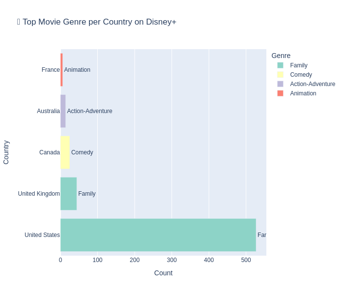
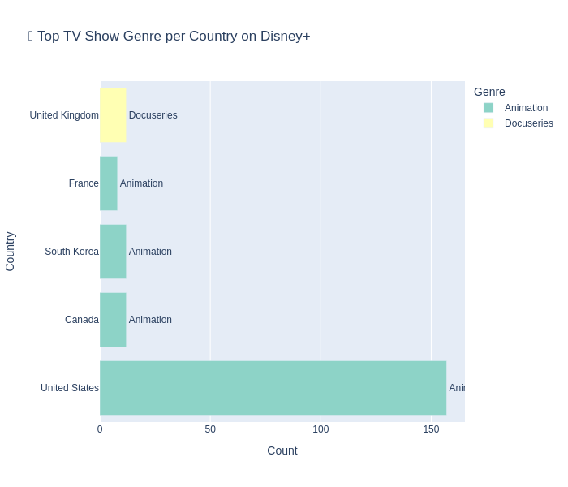
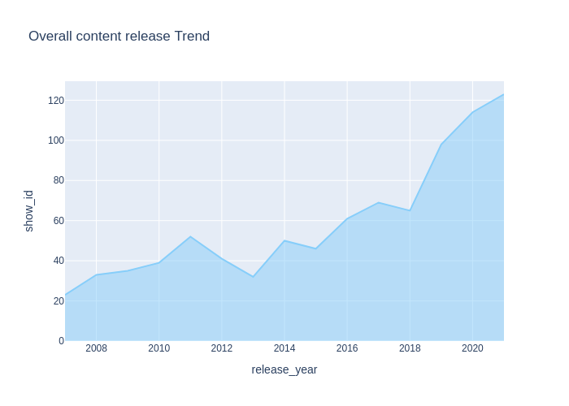
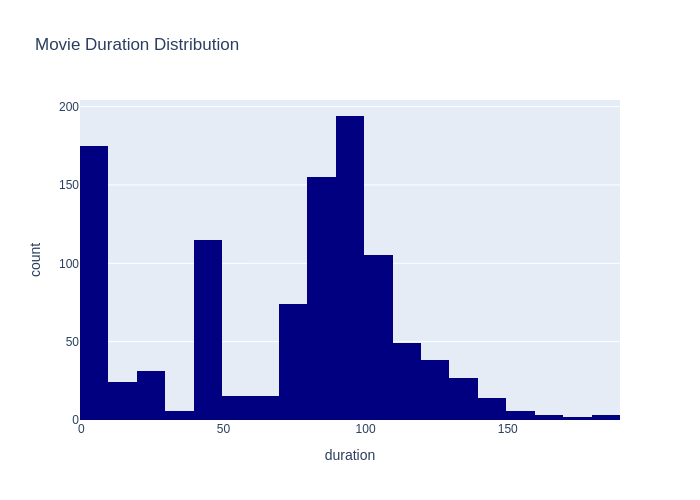

# 🏰 Disney+ Data Deep Dive 📊  
Ever wondered what kind of content rules the magical kingdom of Disney+? Is it movies or TV shows? Action or Animation? Released in summer or stacked up in December? I took a dataset of Disney+ titles and turned it into a colorful, analytical adventure — and yes, even Mickey would approve.

---

## 🎯 Why This Project?
Think of this analysis as a sneak peek into Disney’s streaming brain. By digging into genres, release trends, durations, and more — we don’t just see what’s on Disney+, we start asking *why* it's there and *what to do next*.  

So… could Disney use this as a business plan? Absolutely! Here's how 👇

---

## 🔍 Key Insights (and why they matter)

### 🍿 What Type of Content Rules?
**TV Shows vs Movies?**  
Spoiler: Movies win in sheer volume.  
🧠 *Business angle:* If TV Show watch time is higher per user, Disney might benefit from investing more in episodic content with longer lifespans.

### 🌎 What’s Hot and Where?
**Top genres per country** show that content taste varies globally. For example, “Family” and “Animation” dominate the U.S., while “Drama” might be huge in other regions.  
🧠 *Business angle:* Localization and region-targeted content creation = happier subscribers = more retention!

### 🎬 Genre Royalty
**Most common genre?** "Family" — which honestly, tracks.  
🧠 *Business angle:* Leaning into the “family-first” brand identity keeps Disney unique in the crowded streaming market.

### 📈 Content Over Time
We tracked how Disney+ has been ramping up content each year. There was a clear growth spike after 2019 — aka, Disney+ launch year.  
🧠 *Business angle:* Keep that momentum! Backload releases during low-engagement months to even out viewing.

### ⏳ Show Lengths & Movie Durations
TV shows are mostly short-seasoned, while most movies stay within 90–100 minutes.  
🧠 *Business angle:* More bingeable mini-series? Longer-form storytelling for core fans? The data’s open for interpretation!

---

## 🛠️ Tools Used
- Python (Pandas, Plotly)
- Jupyter Notebooks
- Disney+ Dataset

---

## 📸 Visuals (Because Data Deserves to Look Magical Too)
## 📦 Total Content on Disney+  
Check out what type of content is uploaded the most.

## 🍿 What Type of Content is Uploaded More on Disney+?  

> 🧐 **Insight:** Movies have a strong presence but TV Shows are catching up fast!

---

## 🌍 Top Movie Genre per Country on Disney+  

  

> 🌎 **Insight:** Family and Animation genres dominate globally, reinforcing Disney’s core strengths.

---

## 📺 Top TV Show Genre per Country on Disney+  

  

> 🤔 **Business Idea:** Tailor TV content to fit regional preferences and boost subscriptions.

---

## 📈 Overall Content Release Trend  

  

> ⏳ **Insight:** Steady growth since 2007 means Disney+ is expanding its library and audience consistently.

---

## 🎥 Who Released More? Movies vs TV Shows Over Time  

> 🎞️ **Idea:** Analyze release patterns to identify marketing opportunities or content gaps.

---

## 🕒 Movie Duration Distribution  

  

> 🍿 **Fun Fact:** Most movies hover around 90 minutes, perfect for a cozy movie night!

---

---

## 🧙‍♀️ What’s Next?
This could totally be extended with:
- Viewership or engagement data
- Sentiment analysis on descriptions
- Recommendation system prototypes

---

## 💡 Final Thoughts
Disney+ is more than just a streaming service — it’s a story machine. And like any good story, knowing your audience is key. This project helps uncover patterns that Disney could turn into smart, magical decisions.  

> So… Mickey, if you’re reading this, call me. I’ve got ideas. 😉

